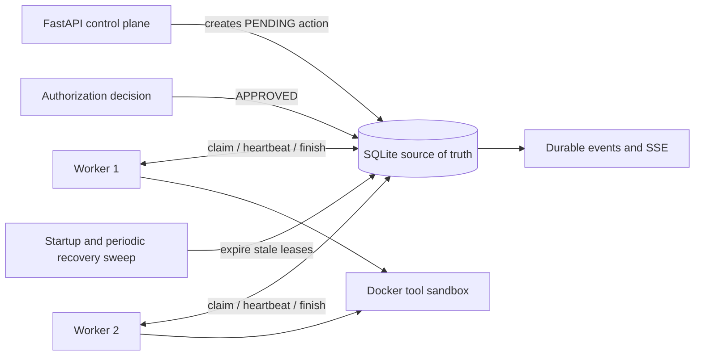

# Multi-Process Worker Dispatch and Idempotency Design

**Status:** Proposed next engineering phase
**Prerequisite:** Worker lease recovery (`b827289`) is implemented and validated.
**Scope:** Local-first, SQLite-authoritative worker coordination on native Ubuntu.

## 1. Objective

The next phase extends the existing single-claim continuation path into a **bounded multi-process worker model** without allowing a second execution of an uncertain action. It introduces explicit, runtime-owned idempotency classification, worker registration and heartbeat records, atomic dispatch claims, and recovery policies that distinguish an action that must stop from one that can be independently proven safe to retry.

> **Safety invariant:** A model never classifies an action as retryable or idempotent. Tool definitions and runtime verification own that decision. An action with an uncertain side effect remains failed after a worker crash unless an explicit policy and independent verifier prove that another execution is safe.

The design does not introduce a hosted queue, external broker, or autonomous always-on deployment. The initial implementation runs local worker processes against the existing SQLite database and is intended for native Ubuntu, where the Docker sandbox and filesystem semantics match production assumptions.

## 2. Current Baseline

The completed runtime already provides the following guarantees.

| Existing capability | Current behavior | Limitation addressed by this phase |
| --- | --- | --- |
| Durable action state | `PENDING → APPROVED → EXECUTING → EXECUTED / FAILED` is stored in SQLite. | An action is claimed by the API request path rather than a worker pool. |
| Atomic claim | Only one request may transition an `APPROVED` action to `EXECUTING`. | There is no worker registry, queue scheduling, or capacity-aware dispatch. |
| Lease recovery | An `EXECUTING` action with an expired lease is failed at startup. | Recovery always terminates work; it cannot distinguish a safe re-claim from an uncertain side effect. |
| Lease heartbeat | The executing continuation renews its own lease while a tool runs. | Worker liveness and lease metrics are not independently visible across processes. |
| Audit visibility | Action history exposes owner, lease expiry, recovery reason, and events. | Dispatch attempt history and idempotency evidence are not yet retained. |

## 3. Non-Goals

This phase must not add the following behavior.

| Non-goal | Rationale |
| --- | --- |
| Model-selected idempotency | The model cannot judge whether an external or filesystem side effect is safe to repeat. |
| Automatic retry of `shell.execute`, `python.execute`, delete, or external-side-effect tools | A crash can occur after a side effect and before durable completion is written. Repeating such work can duplicate damage. |
| Distributed database replacement | SQLite remains the local source of truth. A hosted queue or multi-host database is a future scaling decision. |
| Unbounded worker spawning | Worker count is configuration-driven and locally capped. |
| Persistent cloud deployment | The phase supplies a local worker launcher and contracts; deployment topology remains a separate decision. |

## 4. Dispatch Architecture

### 4.1 Recommended Initial Topology

The recommended initial topology is a **single SQLite database with one API process and a bounded set of local worker processes**. Each worker has a stable generated identity for its lifetime, registers itself, sends a heartbeat, atomically claims eligible work, and owns the lease until it finishes or exits.



SQLite serializes writers, which is acceptable for the intended local worker count. The design must use short `BEGIN IMMEDIATE` transactions for claims and status changes; workers must never hold a database transaction while performing a tool action.

### 4.2 Deployment Options

| Approach | Trade-offs | Cost | Setup complexity |
| --- | --- | ---:| --- |
| **One API process with one local worker** | Simplest operation; validates worker registry and dispatch contracts; no parallel throughput. | No additional cost. | Low. |
| **One API process with a bounded local worker pool** | Recommended next phase; permits isolated tool execution and concurrent eligible runs while SQLite remains authoritative. | No additional cost on the existing Ubuntu machine. | Moderate. |
| **External queue and multi-host workers** | Higher throughput and host fault tolerance; requires a separate database/broker, operational monitoring, and a new trust boundary. | Infrastructure-dependent. | High. |

The initial implementation should deliver the second option but retain a configuration value of `max_workers = 1` as the safe default.

## 5. Contracts

### 5.1 Runtime-Owned Idempotency Classification

Add an enum owned by `ToolDefinition`, not by model messages or action arguments.

```python
class RecoveryClass(str, Enum):
    NEVER_RECLAIM = "NEVER_RECLAIM"
    VERIFY_BEFORE_RECLAIM = "VERIFY_BEFORE_RECLAIM"
    IDEMPOTENT_RECLAIM = "IDEMPOTENT_RECLAIM"
```

| Class | Meaning | Crash-recovery behavior | Initial eligible tools |
| --- | --- | --- | --- |
| `NEVER_RECLAIM` | Repetition could duplicate or worsen an uncertain side effect. | Mark `FAILED` with `WORKER_CRASH_RECOVERY`; require human review or a new action. | `shell.execute`, `python.execute`, `filesystem.delete_file`, all future network/external tools. |
| `VERIFY_BEFORE_RECLAIM` | A verifier can determine whether the desired effect is absent, present, or uncertain. | Re-claim only when verification proves the effect is absent; otherwise fail or mark completed according to the verifier outcome. | Future narrowly scoped file mutation operations after explicit verifier design. |
| `IDEMPOTENT_RECLAIM` | Repeating identical arguments is safe and produces an equivalent intended state. | Re-claim only within the configured attempt cap and only after independent precondition verification. | No tool should receive this class in the first implementation without a dedicated proof and test suite. |

All existing tools must default to `NEVER_RECLAIM`. The first dispatch release should retain the current **fail-safe-only** recovery policy even after the enum exists. This establishes correct classification and audit evidence before enabling any automatic re-claim path.

### 5.2 Worker Contract

```python
@dataclass(frozen=True, slots=True)
class WorkerIdentity:
    worker_id: str
    hostname: str
    process_id: int
    started_at: datetime
    capabilities: frozenset[str]

@dataclass(frozen=True, slots=True)
class DispatchClaim:
    action_id: UUID
    run_id: UUID
    worker_id: str
    attempt: int
    lease_expires_at: datetime
    recovery_class: RecoveryClass
    operation_key: str
```

A worker may dispatch an action only when all of the following conditions hold:

1. The worker is registered, active, and has a current heartbeat.
2. The action is `APPROVED`, scheduled no later than the current time, and within its dispatch-attempt limit.
3. The worker advertises the capability required by the tool class.
4. The claim update succeeds in one SQLite transaction with `WHERE status = 'APPROVED'`.
5. The runtime, not the worker, has calculated the action's recovery class and canonical operation key.

### 5.3 Canonical Operation Key

Persist an `operation_key` created by the runtime:

```text
SHA-256(tool_name + canonical JSON arguments + workspace_id + tool contract version)
```

The key supports audit correlation and future idempotency proofs. It must not alone authorize a retry. A matching key says only that two requests intend the same operation; the recovery class and independent verifier determine whether repeating it is safe.

## 6. Storage Design

### 6.1 `workers` Table

```sql
CREATE TABLE workers (
    worker_id TEXT PRIMARY KEY,
    hostname TEXT NOT NULL,
    process_id INTEGER NOT NULL,
    capabilities_json TEXT NOT NULL,
    state TEXT NOT NULL CHECK (state IN ('STARTING', 'ACTIVE', 'DRAINING', 'STOPPED')),
    started_at TEXT NOT NULL,
    last_heartbeat_at TEXT NOT NULL,
    stopped_at TEXT,
    created_at TEXT NOT NULL,
    updated_at TEXT NOT NULL
);

CREATE INDEX idx_workers_active_heartbeat
    ON workers(state, last_heartbeat_at);
```

### 6.2 `pending_actions` Migration

Retain the existing worker lease fields and add the following nullable, migration-safe columns.

| Column | Purpose |
| --- | --- |
| `recovery_class` | Runtime-owned `RecoveryClass` recorded at action creation. |
| `operation_key` | Canonical SHA-256 action identity for audit and future retry control. |
| `dispatch_attempt` | Number of successful worker claims. Starts at zero. |
| `max_dispatch_attempts` | Runtime-owned cap. Starts at one for all current tools. |
| `available_at` | Earliest time an eligible action may be dispatched. Supports future bounded backoff without changing state semantics. |
| `previous_worker_id` | Preserves the last owner when a future re-claim is explicitly permitted. |
| `recovery_verification_json` | Sanitized independent verifier evidence for a recovery decision. |

The first release must add these fields but set `max_dispatch_attempts = 1`. Therefore a recovered action remains terminal `FAILED`; no automatic retry behavior changes yet.

### 6.3 `action_attempts` Table

Do not overload `pending_actions` as the only historical record. Add append-only dispatch attempts.

```sql
CREATE TABLE action_attempts (
    id INTEGER PRIMARY KEY AUTOINCREMENT,
    action_id TEXT NOT NULL REFERENCES pending_actions(id) ON DELETE CASCADE,
    attempt INTEGER NOT NULL,
    worker_id TEXT NOT NULL,
    status TEXT NOT NULL CHECK (status IN ('CLAIMED', 'HEARTBEAT', 'EXECUTED', 'FAILED', 'RECOVERED')),
    detail_json TEXT,
    created_at TEXT NOT NULL,
    UNIQUE(action_id, attempt, status, created_at)
);

CREATE INDEX idx_action_attempts_action ON action_attempts(action_id, attempt);
```

This table is append-only. It provides an evidence trail without mutating prior ownership records.

## 7. Claim and Recovery Algorithms

### 7.1 Atomic Dispatch Claim

1. A worker asks the repository for one eligible `APPROVED` action.
2. The repository starts a short immediate transaction.
3. It calculates an expiry from `worker_lease_seconds`.
4. It conditionally updates one row only when its status remains `APPROVED`, the dispatch-attempt cap permits execution, and `available_at` is due.
5. The update sets `EXECUTING`, current worker ID, claim/lease timestamps, and increments `dispatch_attempt`.
6. It inserts an `action_attempts` `CLAIMED` record in the same transaction.
7. The worker commits before it executes any tool.

A failed conditional update means another worker won the action. The losing worker does not retry the same row in a busy loop; it returns to bounded polling with jitter.

### 7.2 Heartbeat

Workers update their own `workers.last_heartbeat_at`. A claimed action lease is renewed only when both the action's `worker_id` and the worker row remain active. Every renewal produces a sampled `HEARTBEAT` attempt event, not an unbounded event stream; the sampling interval is configuration-driven.

### 7.3 Crash Recovery

The recovery sweep runs at worker startup and on a bounded interval. For each expired `EXECUTING` action:

1. Load the tool's persisted `recovery_class`, not the current model output.
2. Record `RECOVERED` attempt evidence including prior worker ID, lease age, recovery class, and reason.
3. If `NEVER_RECLAIM`, mark `FAILED` exactly as the current runtime does.
4. If `VERIFY_BEFORE_RECLAIM`, invoke an operation-specific independent verifier without executing the action. It may only requeue the action when the verifier proves the intended effect is absent and the dispatch-attempt cap permits it.
5. If `IDEMPOTENT_RECLAIM`, require both a valid independent verifier and an explicit tool-level proof test before requeueing.
6. If verification is unavailable, ambiguous, timed out, or returns untrusted output, mark `FAILED`.

> An uncertain effect is never treated as absent. Ambiguity fails closed.

## 8. Control Plane and Observability

| Endpoint or stream | Purpose | Authorization |
| --- | --- | --- |
| `GET /workers` | Active and stale workers, capabilities, heartbeat age, and state. | API token. |
| `GET /workers/{worker_id}` | Worker detail and recent dispatched actions. | API token. |
| `POST /workers/{worker_id}/drain` | Prevent new claims while allowing the current action to finish or expire. | Administrative API token. |
| `GET /runs/{run_id}/actions` | Extend current response with recovery class, operation key prefix, dispatch count, and attempt history. | API token. |
| `GET /actions/{action_id}/attempts` | Append-only claim, heartbeat, completion, and recovery evidence. | API token. |
| SSE events | `worker.registered`, `worker.heartbeat`, `action.claimed`, `action.lease_renewed`, `action.recovered`, `action.reclaim_blocked`, `worker.draining`, and `worker.stopped`. | Existing event access policy. |

Sensitive values must remain absent from event data. Operation keys may be exposed only as truncated hashes. Arguments, tool output, and secrets continue to use existing sanitization rules.

## 9. Configuration

Add a versioned `[dispatch]` section to `config/agent.toml`.

```toml
[dispatch]
enabled = false
max_workers = 1
claim_poll_seconds = 1.0
claim_jitter_seconds = 0.25
worker_stale_seconds = 120
recovery_sweep_seconds = 30
max_dispatch_attempts = 1
heartbeat_event_sample_seconds = 30
```

`enabled = false` is the safe default. Existing request-driven `/continue` behavior remains fully compatible. Enabling worker dispatch must be an explicit local operator decision.

Validation rules:

| Rule | Reason |
| --- | --- |
| `0 < worker_heartbeat_seconds < worker_lease_seconds` | A live worker must renew before expiry. |
| `worker_stale_seconds >= worker_heartbeat_seconds` | Avoid declaring an active worker stale before a missed heartbeat grace window. |
| `max_workers >= 1` | No zero-worker enabled configuration. |
| `max_dispatch_attempts = 1` until per-tool recovery proof is enabled | Prevent accidental behavioral change from safe failure to auto-retry. |
| Poll and sweep intervals have positive lower bounds | Prevent SQLite write contention and busy loops. |

## 10. Security Boundaries

The phase must preserve the following rules.

| Boundary | Required rule |
| --- | --- |
| Model authority | The model cannot select worker, retry class, operation key, attempt cap, or recovery outcome. |
| Runtime policy | Tool definitions own recovery class; risky tools default to `NEVER_RECLAIM`. |
| SQLite concurrency | Only conditional state transitions inside short transactions decide ownership. |
| Recovery verification | Verification is independent, deterministic where possible, sanitized, and fails closed. |
| Authorization | Requeued work may not bypass original authorization. An automatic re-claim reuses only the same approved action and its immutable checkpoint. |
| Cancellation | A cancellation request wins before claim and before requeue. Recovered actions are never requeued after cancellation. |
| Audit | Every ownership transition, heartbeat sample, recovery decision, verification result, and terminal status is durable. |

## 11. Test Plan

### 11.1 Deterministic Unit and Repository Tests

| Test | Acceptance criterion |
| --- | --- |
| Two simultaneous workers claim one action | Exactly one receives `EXECUTING`; one `CLAIMED` attempt is recorded. |
| Foreign worker heartbeat | Lease renewal returns false and does not change expiry. |
| Live owner heartbeat | Lease extends and recovery sweep does not fail the action. |
| Expired `NEVER_RECLAIM` action | Action becomes `FAILED`; no second tool call occurs; recovery event and attempt record exist. |
| Legacy action without lease metadata | Grace-period recovery fails it safely rather than leaving it permanently executing. |
| Cancelled action | It cannot be claimed or requeued. |
| Worker drain | Draining worker receives no new claims but retains its current lease until terminal result. |
| Restart idempotency | Re-running recovery sweep records no duplicate recovery for an already failed action. |

### 11.2 Recovery-Class Tests

| Test | Acceptance criterion |
| --- | --- |
| Tool registry default | Every existing tool is `NEVER_RECLAIM`. |
| Unsupported verifier | `VERIFY_BEFORE_RECLAIM` fails closed. |
| Verifier says effect present | Recovery records completed/ambiguous according to tool contract and does not execute again. |
| Verifier says effect absent | Requeue is allowed only for an explicitly tested recovery class, authorization remains valid, and attempt cap is enforced. |
| Shell/Python crash | No automatic re-claim under any configuration. |

### 11.3 Integration Tests

| Test | Acceptance criterion |
| --- | --- |
| Two local worker processes against one SQLite database | One action is executed once; both workers remain responsive. |
| SIGKILL-style worker disappearance | Lease expires; recovery emits durable evidence; no duplicate tool execution. |
| Docker tool action recovery | Hardened sandbox path remains policy-gated and a crashed action remains failed by default. |
| SSE and API audit | Action and worker endpoints match SQLite attempt records without exposing secret data. |
| Real Qwen3 coding corpus | Existing end-to-end list/read/write cases remain green with dispatch disabled and then with one enabled worker. |

## 12. Implementation Sequence

| Commit | Deliverable | Exit criteria |
| --- | --- | --- |
| 1. Contracts and migrations | Add recovery enum, worker/action-attempt schemas, migration-safe SQLite columns, and configuration validation. | Existing suite remains green; migration tests cover legacy database opening. |
| 2. Repository dispatch primitives | Worker register/heartbeat/drain, atomic eligible-action claim, append-only attempt records, and stale-worker queries. | Concurrent-claim and foreign-heartbeat tests pass. |
| 3. Safe recovery policy | Integrate `NEVER_RECLAIM` recovery and verifier interface; retain global attempt cap of one. | Crash tests prove no duplicate tool execution. |
| 4. Worker runtime | Add bounded local worker launcher, graceful drain, periodic recovery sweep, and process metrics. | Two-process integration test passes on native Ubuntu. |
| 5. Control plane | Add worker/action-attempt endpoints, SSE events, and documentation. | API/SSE audit tests pass with token enforcement. |
| 6. Idempotency pilot | Classify one carefully chosen operation only after its independent verifier and failure-mode proof are reviewed. | Reclaim is demonstrated safely under crash simulation; no risky tool is auto-retried. |

Each commit must preserve contract-first development: add failing tests first, run focused tests, run formatting and lint, run live Docker isolation, run the real Ollama corpus on target hardware, then publish one coherent commit.

## 13. Acceptance Criteria for the Phase

The phase is complete only when all of the following are true.

1. Multiple workers cannot claim the same approved action.
2. Worker ownership and heartbeat data are durable and observable.
3. A stale `EXECUTING` action is handled exactly once by recovery.
4. No existing tool is automatically re-executed after a crash by default.
5. Any future re-claim requires runtime-owned recovery classification, independent verification, an immutable approved checkpoint, and a bounded attempt cap.
6. Cancellation, authorization, budget, command policy, Docker sandbox, secret scrubbing, and workspace boundaries remain enforced during dispatch and recovery.
7. Legacy SQLite databases migrate successfully without losing pending-action history.
8. Native Ubuntu validation passes deterministic tests, Docker isolation, and the real Qwen3 coding corpus.

## 14. Recommendation

Implement **Commits 1–3 first** and keep `dispatch.enabled = false` until the crash and concurrency suite has been baselined on native Ubuntu. Treat automatic re-claim as a separate, narrow pilot—not as a general recovery mechanism. This sequence preserves the project’s central guarantee: runtime evidence and conservative policy, never model preference, decide whether an action may execute again.
